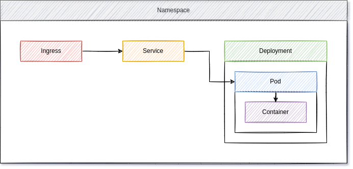

<!--
reference: https://www.makeareadme.com/
reference: https://commonmark.org/
-->

[](https://cirrus-ci.com/github/whiletruedoio/container-template)
[](https://www.codefactor.io/repository/github/whiletruedoio/container-template)
[](https://hub.docker.com/r/whiletruedoio/template)
[](https://github.com/whiletruedoio/container-template/releases)
[](https://github.com/whiletruedoio/container-template/issues)
[](https://github.com/whiletruedoio/container-template/pulls)
[](https://github.com/whiletruedoio/container-template/blob/main/LICENSE)

# Container Template

Template and example for new container repositories.

## Motivation

Starting with containers can be intense and working towards best-practices is
often taking a lot of time. This learning can be a lot easier, if a project is
providing some pracices on its own and guiding new developers.

## Description

The code in this repository is not intended to be used directly. Instead, it
is providing some common scenarios and examples that may be handy, if one wants
to develop containers.

### Container

The container template can be used with [Docker](https://docker.com),
[Podman](https://podman.io) or similar container engines and container
orchestration. You will also find the container images in our
[Docker Hub organization](https://hub.docker.com/u/whiletruedoio/template).

#### Run Container

You can run the image with a simple command.

```sh
# with Podman
$ podman container run -dt -p 8080:80 docker.io/whiletruedoio/template:latest

# with Docker
$ docker container run -dt -p 8080:80 docker.io/whiletruedoio/template:latest
```

Afterwards, you can check the website content via CLI or in your browser,
pointing to <http://localhost:8080>.

```sh
# Check via curl
$ curl localhost:8080
<!DOCTYPE html>
<html>
<head>
    <!-- meta -->
    <meta charset="utf-8" />

...SNIP...

    </footer>

</body>
</html>
```

#### Build Image

To build the image on your own, you will need the repository first.

```sh
# Clone
$ git clone https://github.com/whiletruedoio/container-template.git

# Change into directory
$ cd container-template
```

Now you can make changes to the files or just build the image on your own.

```sh
# with Podman
$ podman image build \
    --tag docker.io/whiletruedoio/template:latest container/

# with Docker
$ docker image build \
    --tag docker.io/whiletruedoio/template:latest container/
```

Afterwards, you can run it the same way as described in the above section.

### Kubernetes

The [Kubernetes](https://kubernetes.io) example demonstrates the usage of
Kubernetes deployments and scenarios. All of them can be used on a
[k3s](https://k3s.io) cluster without any further tuning.

#### Requirements

You need to have access to a Kubernetes instance like [k3s](https://k3s.io) or
[minikube](https://minikube.sigs.k8s.io/docs/) to test the deployment. You can
find some more detailed instructions in the
[tooling repository](https://github.com/whiletruedoio/tooling/)
or in the upstream documentation.

Be aware, that you need to have a proper ingress controller deployed. For k3s,
this is done automatically (Traefik) and for minikube you need to perform
`minikube addons enable ingress`, which will deploy the nginx ingress
controller.

#### Run Deployment

The [Kubernetes example](./kubernetes) provides several files, that can be used
to deploy the template container (docker.io/whiletruedoio/template:latest). The
example provides the below files:

- namespace.yml to create a namespace
- development.yml to create the development and its pods and containers
- service.yml to create a service, pointing to the deployment pods
- ingress.yml to create an ingress for the service

After deploying these files, you will end up with a namespace (template), like
represented in the below diagram.



You can deploy these files with the below commands:

```shell
# Create namespace
$ kubectl apply -f kubernetes/namespace.yml

# Create everything else
$ kubectl apply -f kubernetes/
```

Afterwards, you can check the deployment, services and ingress.

```shell
# Check pods
$ kubectl get pods -n template
# Check service
$ kubectl get services -n template
# Check ingress
$ kubectl get ingress -n template
```

If you want to see the deployment in action, you need to perform some additional
adjustments. The Ingress is listening to the host entry "template.example.com",
which is obviously not pointing to your Kubernetes instance. For k3s, you need
to identify the host address and remember it. For minikube, you can
perform the command `minikube ip` and remember the address.

Now you can create a host entry for you machine, where template.example.com
points to this IP address. In Linux, you need to adjust the `/etc/hosts` files
and add an entry similar to the below example:

```txt
...SNIP...

192.168.49.2 template.example.com
```

There are also options to this without sudo privileges as described in this
[StackExchange question](https://unix.stackexchange.com/questions/10438/can-i-create-a-user-specific-hosts-file-to-complement-etc-hosts)

## Contribute

Thank you so much for considering to contribute! We are happy, when someone is
joining the hard work.

### Issues

Issues and Pull Requests are handled on a regular basis. Please be aware, that
we may reach out to you, ask you to provide additional resources or want to
discuss the issue a little, before planning it.

- [Bugs and Feature Requests](https://github.com/whiletruedoio/container-template/issues)
- [Pull Requests](https://github.com/whiletruedoio/container-template/pulls)

### Develop

Providing code to this repository is pretty straight forward. Open an issue,
so we can discuss the bug/feature and start working on it afterwards. You just
need to open the pull request afterwards and that's it.

It is also strongly recommended to read the
[Contribution Guideline](https://github.com/whiletruedoio/.github/blob/main/docs/CONTRIBUTING.md)
beforehand.

### Changelog

We are maintaining a [changelog](CHANGELOG.md) for repositories. Normally, the
developers will update the changelog, according to
[keepachangelog.com](https://keepachangelog.com/).

### Test

To ensure a high quality and functionality, we want to carefully test our
software. The provided code is automatically tested as described in the
[.cirrus.yml](.cirrus.yml).

## License

Except otherwise noted, all work is [licensed](LICENSE) under a
[BSD-3-Clause License](https://opensource.org/licenses/BSD-3-Clause).

## Contact

Please feel free to reach out to us and the community. We also recommend to read
and understand the
[Code of Conduct](https://github.com/whiletruedoio/.github/blob/main/docs/CODE_OF_CONDUCT.md)
beforehand.

- Site: <https://while-true-do.io>
- Blog: <https://blog.while-true-do.io>
- Code: <https://github.com/whiletruedoio>
- Chat: [libera.chat #whiletruedoio](https://web.libera.chat/gamja/#whiletruedo)
- Mail: [hello@while-true-do.io](mailto:hello@while-true-do.io)
